# Dokumentasi Praktikum CodeIgniter 4 - Versi Parafrase

## Praktikum 1: Implementasi Framework PHP (CodeIgniter)

### Proses Implementasi

#### 1. Konfigurasi Awal
- Mengkonfigurasi ekstensi PHP yang diperlukan untuk menjalankan CodeIgniter
  

#### 2. Pemasangan CodeIgniter 4
- Melakukan unduhan dan ekstraksi file CodeIgniter 4 ke direktori kerja
  

#### 3. Eksekusi Command Line Interface
- Menjalankan aplikasi melalui terminal menggunakan CLI
  

#### 4. Konfigurasi Mode Debug
- Mengonfigurasi environment dengan mengubah file env menjadi .env
  

#### 5. Pembuatan Route Baru
- Menambahkan routing baru dalam file Routes.php
  

#### 6. Implementasi Controller
- Membuat controller Page.php untuk menangani request
  

#### 7. Pembuatan View
- Membuat view about.php untuk tampilan halaman
  

#### 8. Implementasi Layout Web dengan CSS
- Membuat template header dan footer dengan styling
  
  
  

### Hasil Implementasi

Telah berhasil menyelesaikan implementasi kode program untuk seluruh menu yang tersedia di Controller Page, sehingga seluruh navigasi pada header dapat menampilkan halaman dengan layout yang konsisten.

Halaman yang telah dibuat:
- Halaman About: 
- Halaman Contact: 
- Halaman FAQ: 
- Halaman Terms of Service: 
- Modifikasi controller: 

**Output Final Praktikum 1**


## Praktikum 2: Pengembangan Framework dengan CRUD

### Tahapan Pengembangan

#### 1. Pembuatan Database
- Membuat database lab_ci4 beserta tabel artikel
  

#### 2. Konfigurasi Database Connection
- Mengatur file konfigurasi .env untuk koneksi database
  

#### 3. Implementasi Model
- Membuat ArtikelModel.php untuk mengelola data artikel
  

#### 4. Implementasi Controller
- Membuat controller Artikel.php untuk menangani request CRUD
  

#### 5. Implementasi View
- Membuat view index.php pada folder artikel
  

#### 6. Penambahan Data Artikel
- Menambahkan data artikel melalui query SQL
  

#### 7. Implementasi Detail Artikel dan Routing
- Membuat method view() di controller dan file detail.php
  
  
  

#### 8. Implementasi Menu Admin
- Membuat method admin_index() dan view admin_index.php
  
  
  
  
  

#### 9. Fitur Tambah Artikel
- Implementasi method add() dan form_add.php
  
  

#### 10. Fitur Edit Artikel
- Implementasi method edit() dan form_edit.php
  
  

#### 11. Fitur Hapus Artikel
- Implementasi method delete() untuk menghapus data
  

### Pengembangan Tambahan

1. Implementasi CSS untuk Panel Admin
   
2. Fitur Upload Gambar
   
3. Fitur Pencarian Artikel
   

**Output Final Praktikum 2**


## Praktikum 3: Implementasi View Layout dan View Cell

### Tahapan Implementasi

#### 1. Pembuatan Layout Utama
- Membuat folder layout dan file main.php sebagai template utama
  

#### 2. Modifikasi File View
- Mengubah berbagai file view untuk menggunakan layout template yang baru
  
  
  
  
  

#### 3. Penambahan Field Tanggal
- Menambahkan kolom created_at pada tabel artikel
  

#### 4. Implementasi View Cell Class
- Membuat folder Cells dan file ArtikelTerkini.php
  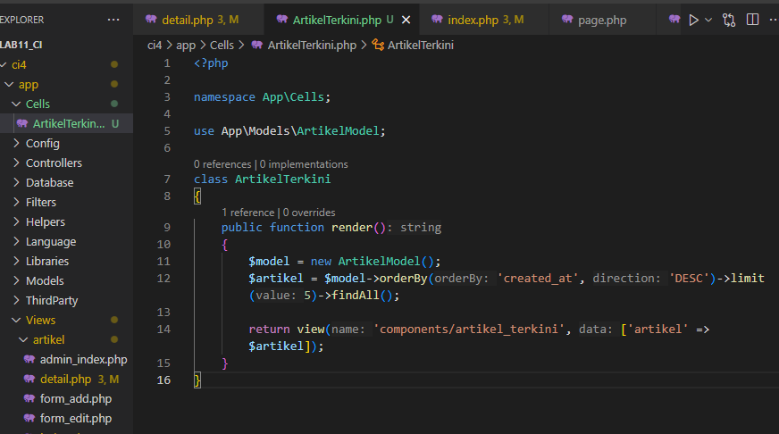

#### 5. Implementasi View untuk View Cell
- Membuat folder components dan file artikel_terkini.php
  

#### 6. Pengembangan - Kategori Artikel
- Menambahkan kolom kategori dan implementasi filter berdasarkan kategori
  

### Analisis dan Pembahasan

#### 1. Keunggulan Penggunaan View Layout dalam Pengembangan Aplikasi

Penggunaan View Layout memberikan beberapa keuntungan signifikan:

1. **Keseragaman Tampilan**: View Layout menjamin bahwa seluruh halaman memiliki struktur dan desain yang seragam.
2. **Pemisahan Concern**: Memisahkan antara konten spesifik halaman dan struktur layout umum, membuat kode lebih terorganisir.
3. **Reusabilitas**: Template layout yang sama dapat digunakan di berbagai halaman tanpa duplikasi kode.
4. **Kemudahan Maintenance**: Perubahan pada layout hanya perlu dilakukan di satu tempat dan akan terimplementasi di semua halaman.
5. **Efisiensi Pengembangan**: Developer dapat fokus pada konten halaman tanpa perlu mengulang pembuatan struktur layout.

#### 2. Perbandingan View Cell dengan View Konvensional

**View Konvensional**:
- Digunakan untuk menampilkan halaman utuh atau bagian halaman
- Dipanggil dengan `return view('nama_view', $data)`
- Biasanya tidak mengandung logika bisnis
- Dapat digunakan kembali dengan include/extend
- Berbagi konteks dengan view yang memanggilnya

**View Cell**:
- Digunakan untuk komponen UI yang dapat digunakan ulang dan bersifat modular
- Dipanggil dengan `<?= view_cell('Namespace\\Class::method', $params) ?>`
- Dapat memiliki logika bisnis sendiri
- Dirancang khusus untuk komponen yang digunakan berulang
- Memiliki konteks tersendiri yang terisolasi

**Output Final Praktikum 3**


## Praktikum 4: Implementasi Sistem Autentikasi

### Tahapan Implementasi

#### 1. Pembuatan Tabel User
- Membuat tabel user pada database lab_ci4
  

#### 2. Implementasi Model User
- Membuat UserModel.php untuk mengelola data user
  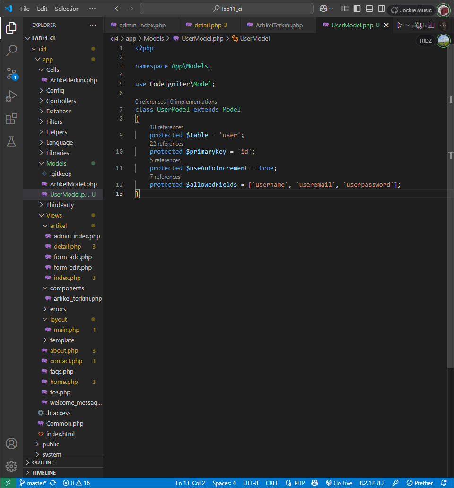

#### 3. Implementasi Controller User
- Membuat User.php dengan method login dan logout
  

#### 4. Implementasi View Login
- Membuat form login di folder user
  
  

#### 5. Implementasi Database Seeder
- Membuat UserSeeder untuk data dummy
  

#### 6. Implementasi Auth Filter
- Membuat filter Auth.php untuk proteksi halaman
  
  
  

#### 7. Implementasi Fungsi Logout
- Menambahkan tombol logout pada interface
  

### Pengembangan Tambahan

1. Implementasi Halaman Register
   
   
   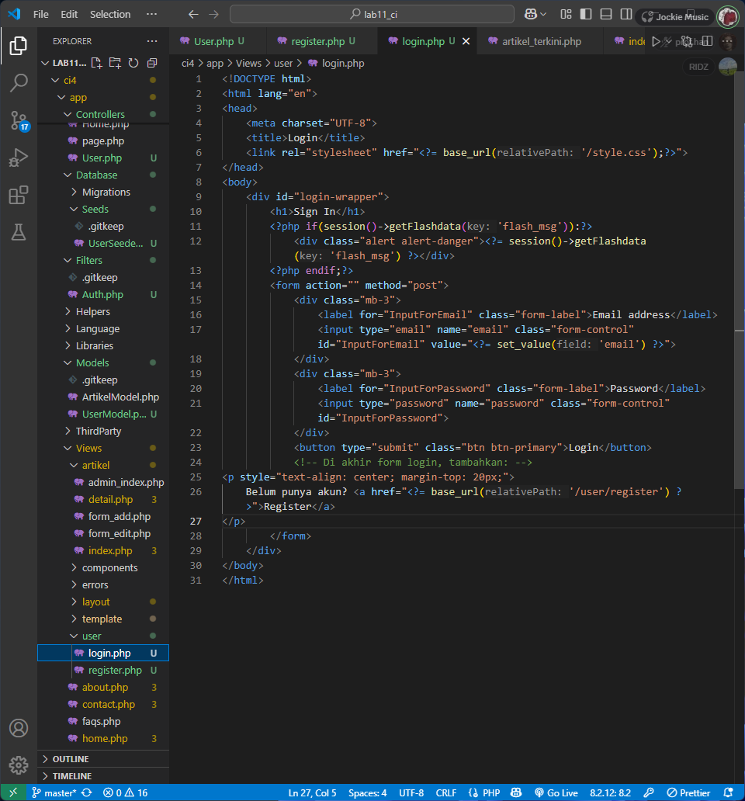

2. Implementasi Dashboard Admin
   
   
   
   

3. Perbaikan Tampilan dengan CSS
   

**Output Final Praktikum 4**


## Praktikum 5: Implementasi Pagination dan Pencarian

### Tahapan Implementasi

#### 1. Implementasi Pagination
Memodifikasi Controller Artikel dan View admin_index.php untuk menampilkan data secara bertahap


#### 2. Implementasi Pencarian
Memodifikasi method `admin_index` untuk menambahkan fitur pencarian dan link pagination, serta menambahkan form pencarian pada view


#### 3. Pengembangan Tambahan
Menambahkan fitur pencarian berdasarkan kategori dan menampilkan jumlah data yang ditemukan

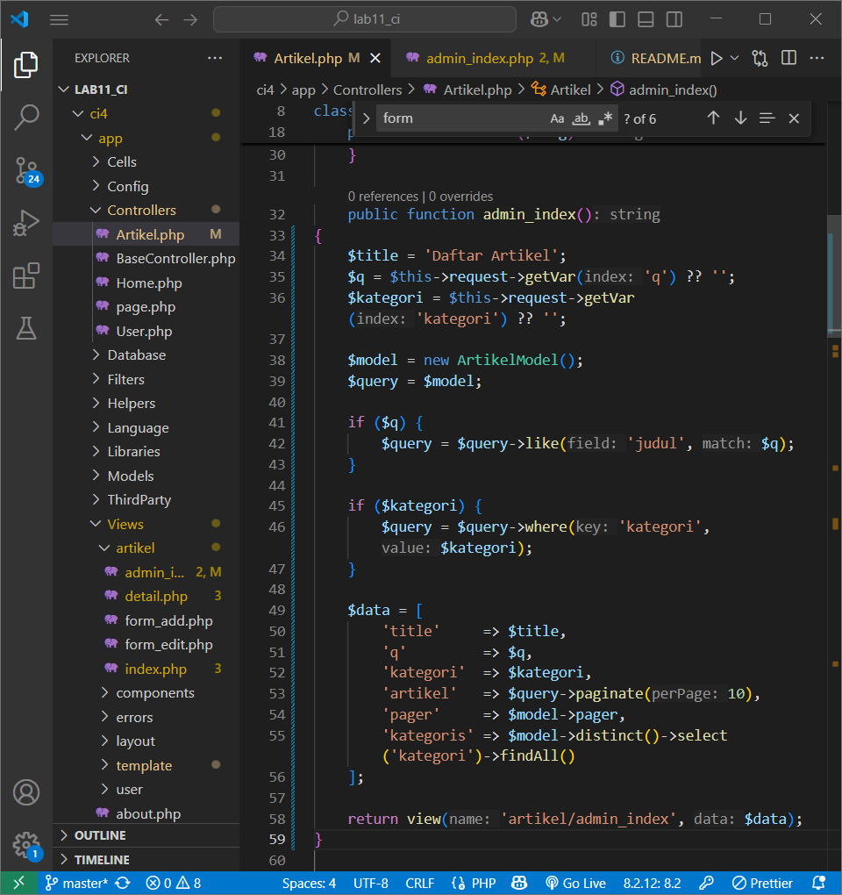


**Output Final Praktikum 5**


## Praktikum 6: Implementasi Upload File Gambar

### Tahapan Implementasi

#### 1. Modifikasi Method add() pada Controller Artikel
Mengupdate Controller Artikel untuk menangani upload file


#### 2. Modifikasi form_add.php
Menambahkan field input file dan menyesuaikan tag form dengan menambahkan encrypt type


#### 3. Pengujian Upload File
Melakukan testing upload file melalui menu tambah artikel


**Output Final Praktikum 6**


## Praktikum 7: Implementasi Relasi Tabel dan Query Builder

### Objektif
- Memahami konsep relasi antar tabel dalam database
- Implementasi relasi One-to-Many
- Melakukan query dengan join tabel menggunakan Query Builder
- Menampilkan data dari tabel yang memiliki relasi

### Tahapan Implementasi

#### 1. Pembuatan Tabel Kategori
Membuat tabel kategori dengan struktur yang sesuai

```sql
CREATE TABLE kategori (
    id_kategori INT(11) AUTO_INCREMENT,
    nama_kategori VARCHAR(100) NOT NULL,
    slug_kategori VARCHAR(100),
    PRIMARY KEY (id_kategori)
);
```


#### 2. Penambahan Foreign Key
Menambahkan kolom id_kategori ke tabel artikel dan membuat foreign key constraint


#### 3. Implementasi Model Kategori
Membuat KategoriModel.php untuk mengelola data kategori

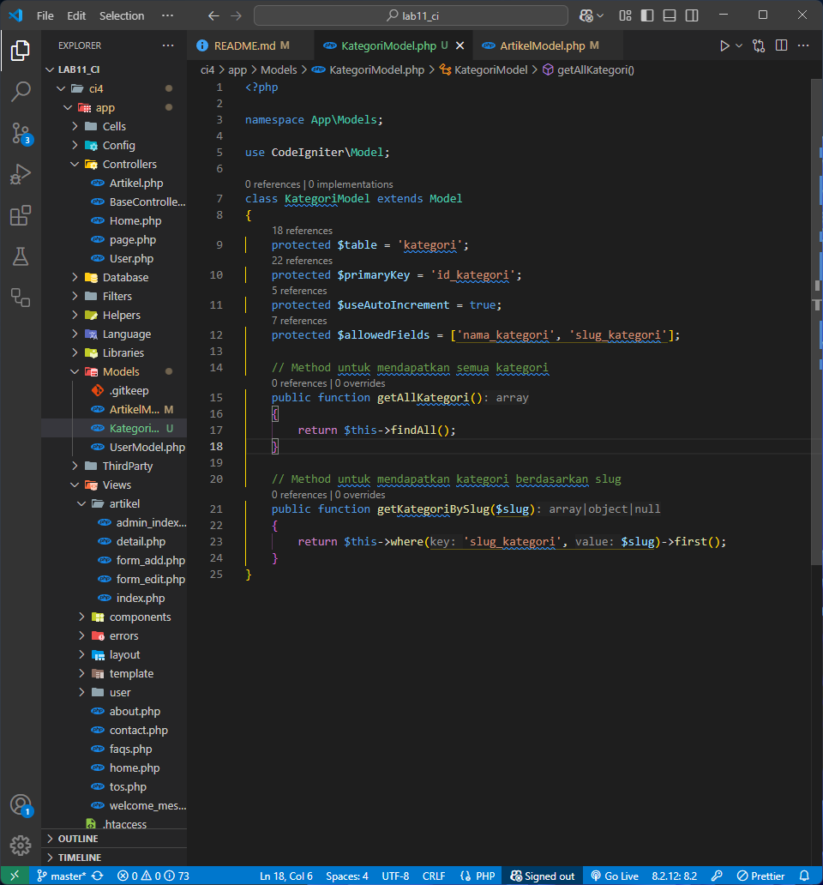

#### 4. Modifikasi Model Artikel
Menambahkan method getArtikelDenganKategori() untuk melakukan JOIN


#### 5. Modifikasi Controller Artikel
Mengupdate controller untuk menggunakan relasi tabel


#### 6. Modifikasi View
Mengupdate semua view untuk menampilkan kategori


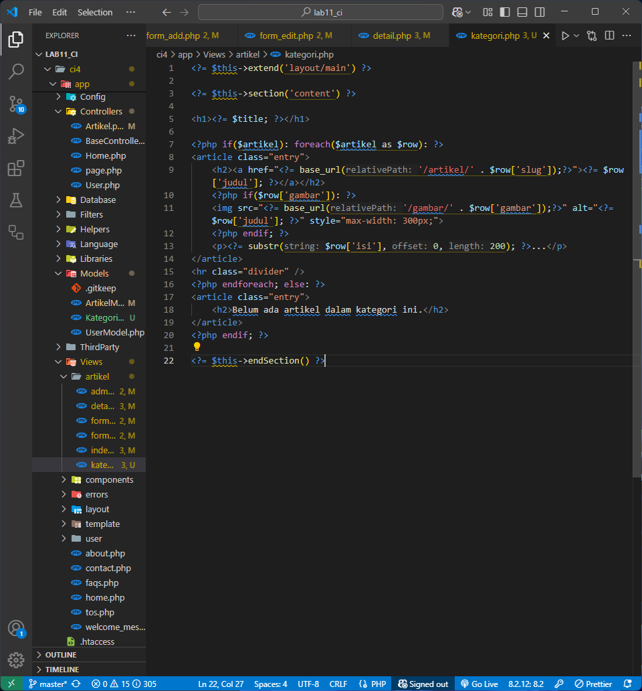

#### 7. Pengujian
Hasil testing menunjukkan semua fitur berjalan dengan baik


**Output Final Praktikum 7**


## Praktikum 8: Implementasi AJAX di CodeIgniter 4

### Tahapan Implementasi

#### 1. Penambahan Library jQuery
Menambahkan jQuery ke project dengan menyalin file ke folder `public/assets/js/`


#### 2. Implementasi AJAX Controller
Membuat controller baru bernama `AjaxController.php` untuk menangani request AJAX


#### 3. Implementasi View
Membuat view untuk menampilkan data artikel dengan AJAX

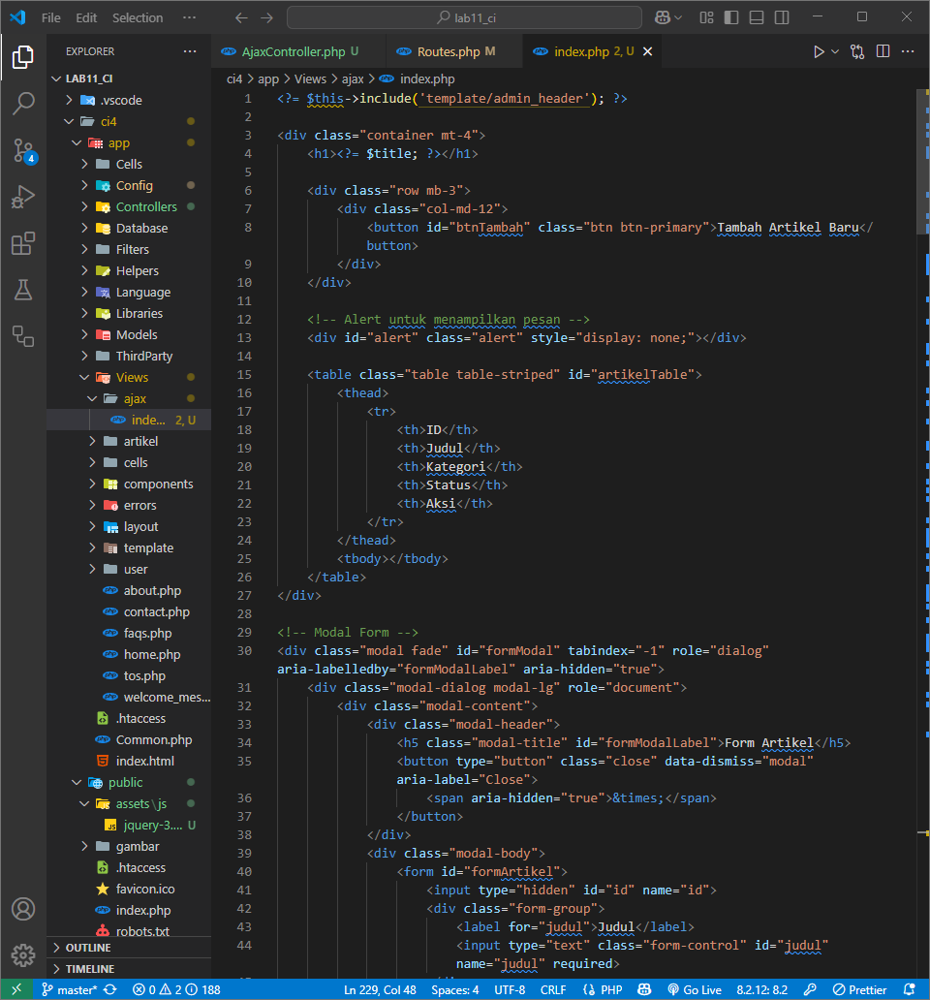
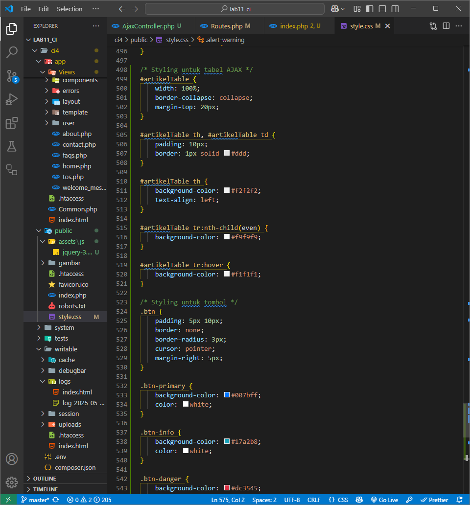

#### 4. Pengembangan Tambahan
Menambahkan fitur pencarian dan filter kategori dengan AJAX

**Output Final Praktikum 8**


## Praktikum 9: Implementasi AJAX Pagination dan Search

### Tahapan Implementasi

#### 1. Persiapan Data
Menambahkan lebih banyak data artikel untuk testing pagination

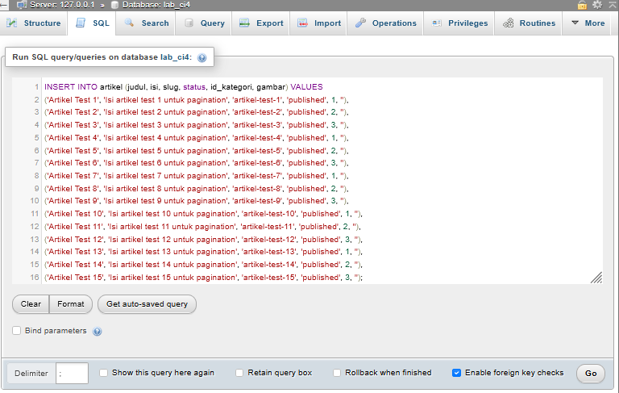

#### 2. Modifikasi Controller Artikel
Mengupdate method admin_index() untuk mendukung AJAX request


#### 3. Modifikasi View admin_index.php
Mengubah view untuk menggunakan AJAX dengan fitur lengkap


### Fitur yang Diimplementasikan
- Search real-time
- Filter kategori
- Pagination tanpa reload
- Sorting kolom

**Output Final Praktikum 9**


## Praktikum 10: Implementasi API

### Tahapan Implementasi

#### 1. Persiapan
Menginstall Postman dan mengatur konfigurasi database


#### 2. Implementasi REST Controller
Membuat file `Post.php` untuk menangani operasi CRUD API

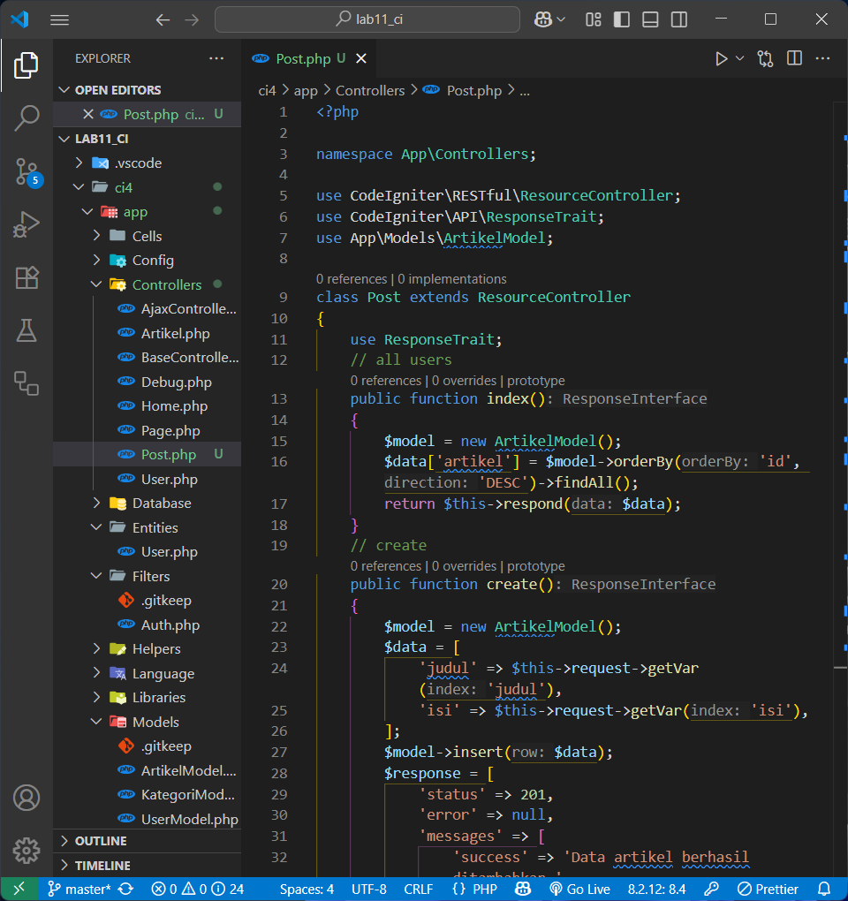

#### 3. Implementasi Routing
Menambahkan rute resource di `app/Config/Routes.php`


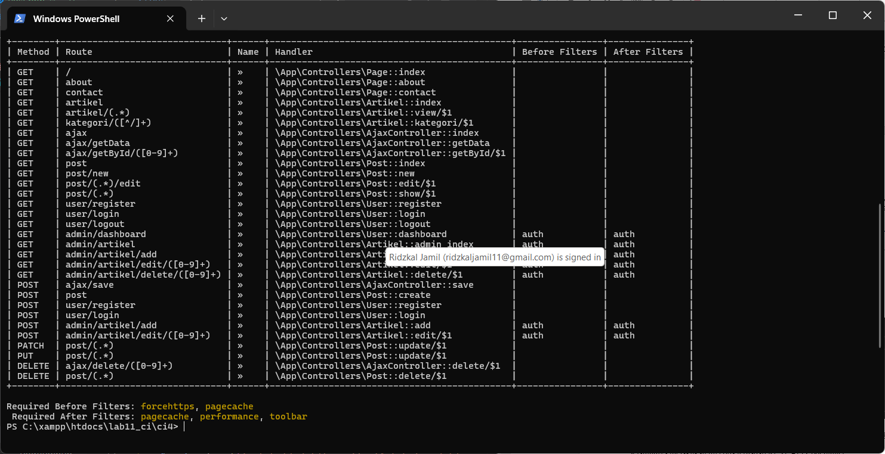

#### 4. Pengujian dengan Postman

**Menampilkan semua data (GET)**:


**Menambahkan data (POST)**:


**Menampilkan data berdasarkan ID (GET)**:


**Mengubah data (PUT)**:


**Menghapus data (DELETE)**:


### Kesimpulan

Praktikum ini berhasil mengimplementasikan REST API dengan CodeIgniter 4 untuk operasi CRUD. API telah diuji menggunakan Postman dan semua fungsi (GET, POST, PUT, DELETE) berjalan dengan baik dan sesuai dengan standar RESTful API.
